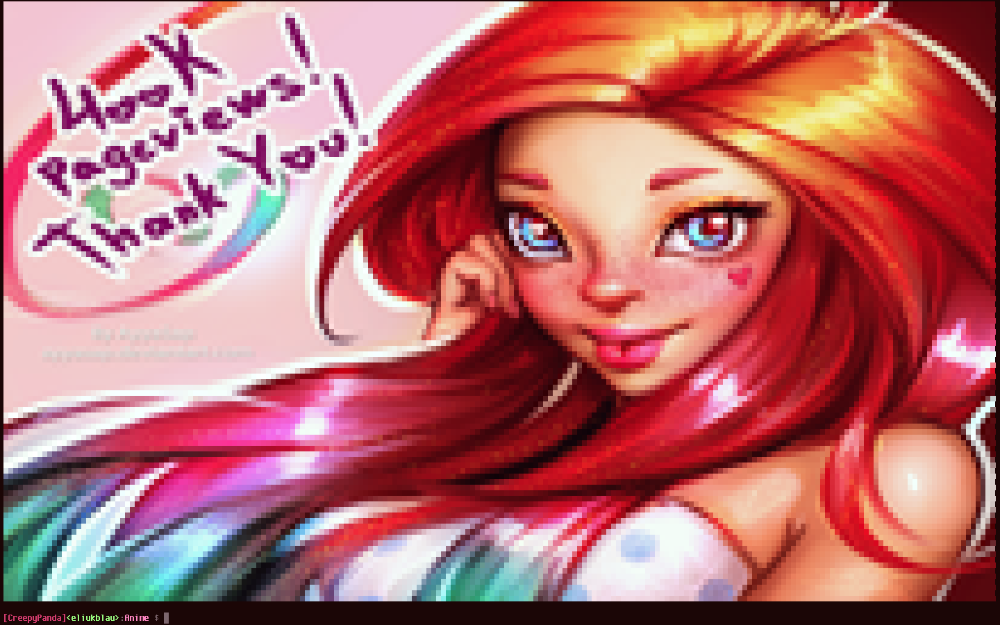
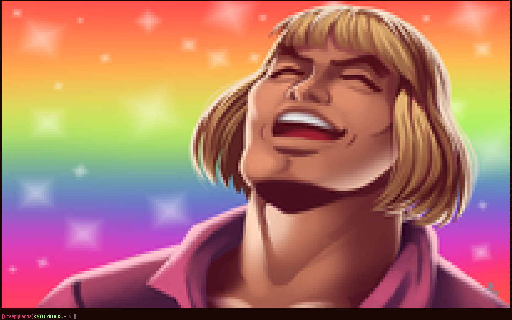

```
   ___  _____  ____
  / _ \/  _/ |/_/ /____ ______ _    Made with love by Eliuk Blau
 / ___// /_>  </ __/ -_) __/  ' \   github.com/eliukblau/pixterm
/_/  /___/_/|_|\__/\__/_/ /_/_/_/   v1.1.0

```

# `PIXterm` - *draw images in your ANSI terminal with true color*

**`PIXterm`** ***shows images directly in your terminal***, recreating the pixels through a combination of [ANSI character background color](http://en.wikipedia.org/wiki/ANSI_escape_code#Colors) and the [unicode lower half block element](http://en.wikipedia.org/wiki/Block_Elements). If image has transparency, an optional matte color can be used for background.

The conversion process runs fast because it is parallelized in all CPUs.

Supported image formats: JPEG, PNG, GIF, BMP, TIFF, WebP.


#### Cool Screenshots








#### Requirements
Your terminal emulator must be support *true color* feature in order to display image colors in a right way. In addition, you must use a monospaced font that includes the lower half block unicode character `▄ (U+2584)`. I personally recommend [Envy Code R](http://damieng.com/blog/2008/05/26/envy-code-r-preview-7-coding-font-released). It's the nice font that shows in the screenshots.


#### Dependencies

All dependencies are directly included in the project via [Go's Vendor Directories](http://golang.org/cmd/go/#hdr-Vendor_Directories). You should not do anything else. Anyway, if you want to get the dependencies manually, project uses the [Glide Vendor Package Management](http://glide.sh). Follow its instructions.

###### Dependencies for `PIXterm` CLI tool

- Package [colorful](github.com/lucasb-eyer/go-colorful): `github.com/lucasb-eyer/go-colorful`
- Package [terminal](http://godoc.org/golang.org/x/crypto/ssh/terminal): `golang.org/x/crypto/ssh/terminal`

###### Dependencies for `ANSImage` Package

- Package [imaging](http://github.com/disintegration/imaging): `github.com/disintegration/imaging`
- Package [webp](http://godoc.org/golang.org/x/image/webp): `golang.org/x/image/webp`
- Package [bmp](http://godoc.org/golang.org/x/image/bmp): `golang.org/x/image/bmp`
- Package [tiff](http://godoc.org/golang.org/x/image/tiff): `golang.org/x/image/tiff`


#### Installation

*You need the [Go compiler](http://golang.org) version 1.6 or superior installed in your system.*

Run this command to automatically download sources and install **`PIXterm`** binary in your `$GOPATH/bin` directory:

`go get -u github.com/eliukblau/pixterm`


#### About

**`PIXterm`** is a terminal toy application that I made to exercise my skills on Go programming language. If you have not tried this language yet, please give it a try! It's easy, fast and very well organized. You'll not regret :D

*This application is inspired by the clever [termpix](http://github.com/hopey-dishwasher/termpix), implemented in [Rust](http://www.rust-lang.org).*


#### License

[Mozilla Public License Version 2.0](http://mozilla.org/MPL/2.0)


#### Contributors

- [disq](http://github.com/disq) - Original code for image transparency support.
